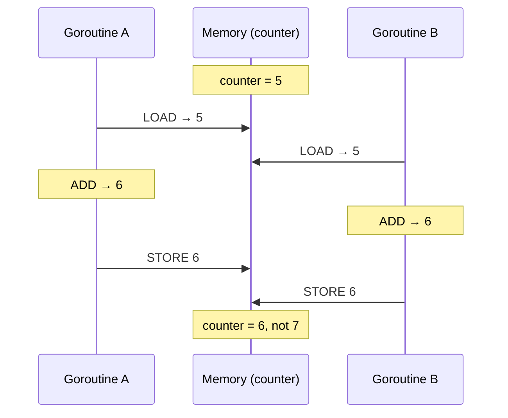
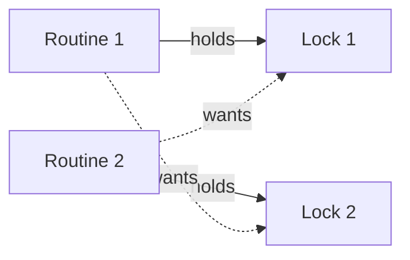

# Coordination Part 1: Threads in One Process

Any time two things run at once and touch the same thing, we have a coordination problem.

That describes a counter shared by two threads, and it also describes two servers writing the same database row, or five machines trying to agree on which one of them is in charge. It is the same problem each time, only the blast radius keeps getting wider.

This series climbs that ladder one rung at a time:

- **Part 1 (this post)**: threads inside one process, sharing memory
- **Part 2**: separate processes on one machine, sharing a disk
- **Part 3**: separate machines, sharing only an unreliable network
- **Part 4**: hands-on code for all of it

Everything above is built out of the ideas we cover here, because a distributed lease is really a mutex that expires, and a leader election is a critical section held by one machine at a time.

Every number below came from actually running the code, on Go 1.25.2 on an M-series Mac, and running them yourself is the point, because one of the results is the opposite of what the textbook rule predicts. All the code is in Go, but you can follow it without knowing Go, since for everything we do here a goroutine behaves like a thread.[^goroutine]

---

## Start by breaking it

Let us start with a thousand goroutines, where each one increments a shared counter a thousand times:

```go
var counter int = 0

func increment(wg *sync.WaitGroup) {
	defer wg.Done()
	for range LIMIT {
		counter++
	}
}
```

Since 1000 × 1000 = 1,000,000, that is what we should see. Here are three consecutive runs:

```
Final value of counter is:  247977
Final value of counter is:  205533
Final value of counter is:  213737
```

We get a wrong answer every time, and it is wrong in a different way on each run. The non-determinism is the worse half of this, because a bug that reproduces reliably is a bug we can chase.

To see how wrong it actually gets, I ran the same binary 150 times. The results ran from 193,153 to 338,196 with a median of 255,517, and 144 of the 150 finished below 30%.

That was not quite what I expected. "Some updates get lost" sounds like it should scatter results across the whole range, and instead they pile up around a quarter of the work surviving. My guess is that a thousand goroutines running identical tiny loops collide in a regular enough pattern to average out, but I have not verified it and nothing below depends on it. I should also admit that my first batch of thirty runs looked much tighter than this, and I nearly wrote that the ratio was stable to within a few percent. Running five times as many trials widened the range considerably, which is a small lesson about sample sizes hiding inside a post about concurrency.

**So what went wrong here?** The line `counter++` looks like a single operation because it is a single line of source, but the CPU does not see a line of source. It sees three separate instructions:

```
LOAD   counter → register     read the current value
ADD    register, 1            add one
STORE  register → counter     write it back
```

Between any two of those instructions the scheduler is free to pause this goroutine and run another one, which lets the following happen:



Two increments ran but only one of them survived, and this is what we call a **lost update**.

*Full program: [`coordination/code/race-condition`](https://github.com/ajit3259/systems-and-layers/tree/main/coordination/code/race-condition)*

Go will point straight at the problem if we ask it to, by running with the race detector:

```bash
go run -race main.go
```

```
WARNING: DATA RACE
Read at 0x000104cec648 by goroutine 7:
  main.increment()
      .../race-condition/main.go:12 +0x84

Previous write at 0x000104cec648 by goroutine 6:
  main.increment()
      .../race-condition/main.go:12 +0x9c
```

It is the same memory address and the same source line, being touched by two different goroutines, and line 12 is exactly our `counter++`. This is worth running against any concurrent code we write, not only the code we already suspect.

---

## The fix that doesn't work

The obvious repair is to add a flag, so that a goroutine waits until nobody is inside and then claims the section for itself:

```go
for locked {           // wait until free
}
locked = true          // claim it
counter++              // critical section
locked = false         // release it
```

This fails, and it fails for exactly the reason we just diagnosed. The loop `for locked {}` reads the flag and `locked = true` writes it, which means we still have two separate steps with a gap between them. Two goroutines can both read `false`, both walk out of the loop, and both go on to write `true`, so the lock we built to fix the race has the very same race living inside it.

Two words are worth pinning down here, because the rest of the series leans on both. The stretch of code that must not be interrupted, our three instructions from `LOAD` to `STORE`, is the **critical section**. The property we need it to have is **atomicity**, meaning it either happens completely or not at all, and no other thread ever catches it half finished.

So we cannot build atomicity out of non-atomic parts, and the indivisibility has to be handed to us by something lower down.

That something is **compare-and-swap**, and every CPU gives us some version of it:

```
CAS(address, expected, new):
    atomically:
        if *address == expected:
            *address = new
            return true
        return false
```

It fuses the compare and the swap into one step that the hardware will not let anything interleave with, and with it our flag finally works:

```
while !CAS(&locked, false, true) {
    // someone else holds it, try again
}
// critical section
locked = false
```

On x86 that step is genuinely one instruction, `CMPXCHG`. On the ARM machine these measurements come from it is usually a pair, `LDXR` and `STXR`, which reserve an address and then refuse the store if anybody else touched it in between, leaving the caller to loop and try again. The guarantee is the same either way and only the implementation differs.

When two goroutines call CAS at the same instant the hardware serializes them, so one of them sees `false` and swaps it to `true` while the other sees `true` and goes back around the loop.

Mutexes, semaphores, channels and atomic counters are all built on this, so if we go one layer down from any of them, this is where we land.

---

## The lock that burns a core

That loop works, but look at what a goroutine actually does while it waits, because it hammers CAS in a tight loop and uses a full core to accomplish nothing. What we have built is a **spinlock**.

Whether that is a bad idea depends entirely on how long the wait is expected to be, and the comparison is fairly direct: is the expected wait shorter or longer than the cost of putting a thread to sleep and waking it up again, which runs on the order of a microsecond?

| | Spinlock | Mutex |
|---|---|---|
| While waiting | Burns CPU in a loop | Sleeps, OS deschedules the thread |
| Uncontended acquire | One CAS, very cheap | One CAS, also cheap |
| Contended acquire | Wasted cycles | Two context switches, sleep then wake |
| Good when | Critical section is a few instructions | Critical section is long or does I/O |

If the critical section is three instructions then spinning wins, because going to sleep would cost more than the wait itself. If the critical section does a disk read then spinning is a disaster, because we have burned a core for milliseconds.

A **mutex** takes the other path, so on a failed acquire the thread goes onto a wait queue and is descheduled and uses no CPU at all, and the OS wakes one waiter when the holder releases. Real implementations, including Go's `sync.Mutex` and Linux futexes, usually spin briefly first and then fall back to sleeping, which gives us both behaviours.

---

## Now the counter works

```go
type safeCounter struct {
	count int
	mu    sync.Mutex
}

func increment(wg *sync.WaitGroup, counter *safeCounter) {
	defer wg.Done()
	for range LIMIT {
		counter.mu.Lock()
		counter.count++
		counter.mu.Unlock()
	}
}
```

*Full program: [`coordination/code/mutex`](https://github.com/ajit3259/systems-and-layers/tree/main/coordination/code/mutex)*

Now, when we run this program we get 1,000,000 every run, and the race detector remains silent when we run with `-race`.

One detail here is worth copying into our own code. The mutex lives inside `safeCounter`, in the same struct as the field it guards. A mutex protects data, but nothing in the language enforces *which* data it protects, so that mapping exists only in the programmer's head, and putting the two of them into one struct is how we write it down. A mutex declared far from the variable it guards may be a bug waiting for a new teammate.

---

## The experiment that went the other way

The standard advice is to keep critical sections small, which here means taking the lock once per increment instead of once around the whole loop. The reasoning is that a lock held for a shorter time leaves other goroutines waiting for less of it, so more of them get to make progress.

So I wrote both versions and timed them.

```go
// fine-grained: lock per increment
for range LIMIT {
    counter.mu.Lock()
    counter.count++
    counter.mu.Unlock()
}

// coarse-grained: lock once, do all 1000 increments, release
counter.mu.Lock()
for range LIMIT {
    counter.count++
}
counter.mu.Unlock()
```

Both versions give us 1,000,000, so the only thing separating them is speed. Timing them three times each:

```
fine     count=1000000  elapsed=84.888250ms
coarse   count=1000000  elapsed=938.291µs

fine     count=1000000  elapsed=63.278209ms
coarse   count=1000000  elapsed=1.004375ms

fine     count=1000000  elapsed=63.020625ms
coarse   count=1000000  elapsed=900.667µs
```

The version we are told is better turns out to be sixty to ninety times slower, and the first run of any session is always the worst of the three.

*Full program: [`coordination/code/lock-granularity`](https://github.com/ajit3259/systems-and-layers/tree/main/coordination/code/lock-granularity)*

The reason is that the fine-grained version does 1,000,000 lock and unlock pairs where the coarse one does only 1,000, and those extra 999,000 lock operations buy us nothing because there was never any parallelism available to win in the first place.

Every increment touches the same counter, so every increment has to be serialized no matter which version we run, and the total amount of serialized work is identical in both. What fine-grained locking adds on top of that is a million lock and unlock operations, each one an atomic instruction, with a thousand goroutines all reaching for the same mutex. Many of those attempts find it already taken, and a goroutine that cannot get in is parked and later woken again, which is not free. Underneath that, the counter and the mutex live in the same **cache line**, which is the 64 byte block a CPU actually moves in and out of its cache. Only one core can hold a cache line for writing at a time, so a line being written by a thousand goroutines across several cores spends its life being handed from one core to the next. The coarse version instead lets each goroutine take the lock once and run its thousand increments with that line sitting in its own core the whole time.

So the rule that actually holds is narrower than the one we started with. Fine-grained locking pays off when goroutines have work they can do *outside* the lock, so that shortening the critical section lets that outside work overlap. In our counter there is no outside, because the critical section is the entire job.

Granularity is therefore not a case of smaller being better, and it is better thought of as a dial:

- **Fine-grained** gives us more overlap when there is something to overlap, but it costs more lock overhead and more contention. Once a program holds several locks rather than the single one we have here, finer granularity also means more chances to acquire them in an inconsistent order, which is where the deadlock at the end of this post comes from.
- **Coarse-grained** costs less overhead and is simpler to reason about, but it serializes work that might have been able to run in parallel.

Read this benchmark for what it is, which is one machine running one fairly pathological workload where the shared state is all there is. If we put real work between the increments then the ranking flips back again. The point is not that coarse-grained always wins, but that "keep critical sections small" is a heuristic with a reason sitting behind it, and when the reason does not apply then the heuristic does not either.

Databases live on the same dial, since row-level versus table-level locking is this exact decision. They also have an escape hatch that we do not, called [MVCC](https://en.wikipedia.org/wiki/Multiversion_concurrency_control), or multi-version concurrency control. Instead of making a reader wait for a writer to finish, the database keeps more than one version of a row at a time and hands each reader the version that existed when its transaction began, so a reader never has to take a lock at all and never blocks behind a writer.

---

## Two seats, ten people

Let us take a new scenario, a movie hall with 2 seats and 10 goroutines that want to get in.

If we reach for the tool we now have, it does not fit, because a mutex admits exactly one holder, which means nine people queue outside while one of the two seats sits empty all evening. We have not modelled the hall at all, we have throttled it to half of its capacity.

What we want is a lock that counts, and that is a **semaphore**, which is a counter plus two atomic operations:

```
acquire():  wait until counter > 0, then counter--
release():  counter++
```

A semaphore initialized to 2 is our movie hall. Initialized to 1 it behaves almost exactly like a mutex, with one difference worth knowing: a mutex is owned by whoever locked it and conventionally only that holder may unlock it, whereas any thread at all can release a semaphore it never acquired. That freedom is occasionally useful and is more often a way to write a bug.

Go's `sync` package has no semaphore type and does not really need one, because a buffered channel of size N already behaves like a semaphore with count N. Sending on it blocks when the buffer is full, which gives us acquire, and receiving from it frees a slot and unblocks a waiting sender, which gives us release.

```go
sem := make(chan struct{}, MOVIE_SLOTS)   // capacity 2

func movie_watcher(wg *sync.WaitGroup, sem chan struct{}, id int) {
	defer wg.Done()

	println("goroutine: ", id, " waiting for seat")
	sem <- struct{}{}                     // acquire, blocks if full

	time.Sleep(interval)                  // watching the movie

	<-sem                                 // release, frees a seat
}
```

```
goroutine:  2  waiting for seat
goroutine:  9  waiting for seat
goroutine:  5  waiting for seat
...
goroutine:  2  watching movie for:  3805  ms
goroutine:  9  watching movie for:  3233  ms
goroutine:  9  left seat
goroutine:  5  watching movie for:  9566  ms
```

*Full program: [`coordination/code/semaphore`](https://github.com/ajit3259/systems-and-layers/tree/main/coordination/code/semaphore)*

Ten goroutines queue up, two of them watch, and a new one only gets in once a seat frees up. The `struct{}{}` we send is a zero-byte value, because what matters to us is the slot itself and not anything we put in it.

Connection pools, rate limiters and "at most 10 concurrent uploads" are all this same pattern.

---

## Waiting for something that isn't a slot

For our next scenario, a consumer wants to pull from a queue and the queue is empty. This is not a case of waiting for a free slot, it is a case of waiting until a fact about shared state becomes true, and a semaphore does not express that.

Our first attempt is to spin:

```go
for queue.isEmpty() {
    // check again
}
```

This is correct, but it burns a core for a wait that might last a second.

Our second attempt is to sleep instead of spinning, which needs somebody to wake us. Assume the producer, after adding an item, calls a `signal()` that wakes one sleeping consumer. Now the consumer checks whether the queue is empty and goes to sleep if it is. This version is actually worse than the spin, because it hangs:

```
if queue.isEmpty() {     // thread A checks: empty
                         // thread B adds an item and signals "not empty"
    sleep()              // thread A sleeps anyway, and nobody will signal again
}
```

Thread A went to sleep holding a belief that expired between the check and the sleep, because the signal it needed was sent while it was sitting in the gap. This is the **missed wakeup problem**, and it has the same shape as the flag we tried earlier, which is two steps that needed to be one.

A **condition variable** fuses them, and its defining operation releases the lock and goes to sleep as a single indivisible step:

```go
mu.Lock()
for queue.isEmpty() {     // for, not if
    cond.Wait()           // atomically release mu and sleep. On wake, re-acquire mu.
}
item := queue.pop()
mu.Unlock()
```

There is now no instant where the thread has let go of the lock but is not yet asleep, so no signal can slip through the gap.

There are two things here that are not optional. The first is that we always pair a condition variable with a mutex, because the condition is a claim about shared state, so we need the lock in order to evaluate it safely and `Wait()` needs a lock that it can release. The second is that we always re-check the condition with `for` and never with `if`, partly because another waiter may have woken up first and taken the item, which means the queue can be empty again by the time we hold the lock, and partly because most implementations are permitted to wake a thread with no signal at all, which is called a **spurious wakeup**. When `Wait()` returns it only means that something may have changed and we should go and look, not that the condition is now true.

This is the one idea in the post with no hands-on of its own, and that is deliberate. Go does have `sync.Cond`, but the language pushes us somewhere else, because the idiomatic answer to "wait until there is something in the queue" is a channel, which already has release-and-sleep built into it, and the next section is that version. Condition variables are still worth understanding, because in C, Java or pthreads this is the primitive we are handed directly, and because the missed wakeup problem does not disappear when we use a channel. It just moves inside the channel's implementation, where somebody else has already solved it for us.

---

## Putting it together, and getting it wrong

In the producer-consumer problem, producers generate work and consumers process it, with a bounded queue sitting between them, so that producers block when the queue is full and consumers block when it is empty.

The textbook build uses two semaphores and a mutex:

```
empty  = semaphore(N)    // free slots
filled = semaphore(0)    // items available
mu     = mutex           // protects the buffer itself

producer:                     consumer:
  empty.acquire()               filled.acquire()
  mu.lock()                     mu.lock()
  buffer.push(item)             item = buffer.pop()
  mu.unlock()                   mu.unlock()
  filled.release()              empty.release()
```

Each semaphore counts one side of the constraint while the mutex protects the internals of the buffer. The ordering here matters more than it looks, because we have to take the semaphore *before* the mutex. If we do it the other way around, grabbing the mutex and then blocking on a full queue while still holding it, we hang immediately, since the consumer needs that same mutex in order to drain the queue.

In Go a buffered channel is already all of that at once, giving us the bounded queue, both semaphores and the internal locking:

```go
ch := make(chan int, JOB_QUEUE_SIZE)

func producer(wg *sync.WaitGroup, ch chan int, id int) {
	defer wg.Done()
	for range JOB_CNT {
		ch <- rand.Intn(MAX_JOB_DURATION)     // blocks when full
	}
}

func consumer(wg *sync.WaitGroup, ch chan int, id int) {
	defer wg.Done()
	for job_duration := range ch {            // blocks when empty, exits on close
		time.Sleep(time.Duration(job_duration) * time.Millisecond)
	}
}
```

*Full program: [`coordination/code/producer-consumer`](https://github.com/ajit3259/systems-and-layers/tree/main/coordination/code/producer-consumer)*

The version in the repository runs three producers and two consumers over a queue of size three, and the genuinely interesting part of it is not the work, it is the shutdown. Somebody has to close the channel, it is only safe to close once every producer has finished, and closing it is what lets the consumers stop. The obvious way to arrange that is a single `sync.WaitGroup` covering all five goroutines, which we then wait on before closing the channel. It looks correct and it dies:

```
fatal error: all goroutines are asleep - deadlock!

goroutine 1 [sync.WaitGroup.Wait]:
main.main()
	.../main.go:41

goroutine 7 [chan receive]:
main.main.func2(0x0?)
```

Main is waiting on the WaitGroup, while the consumers are sitting inside `range ch` waiting for a channel that only closes after the WaitGroup returns, so everybody is waiting for somebody else to move first.

The fix is to use two WaitGroups, because we are really asking two different questions and one counter cannot answer both of them:

```go
go func() {
	producer_wg.Wait()    // all producers finished
	close(ch)             // so no more work is coming
}()
consumer_wg.Wait()        // all consumers drained the channel
```

Knowing that the producers are done is what tells us it is safe to close the channel, and knowing that the consumers are done is what tells us it is safe to exit, so if we collapse those two facts into one counter we get the hang above.

---

## The same hang, on purpose

That failure has a more general shape, which we can see with two mutexes and two goroutines that acquire them in opposite order:

```go
func routine_1(locks *doubleLock) {
	locks.first_mu.Lock()
	time.Sleep(10 * time.Millisecond)
	locks.second_mu.Lock()      // waits for routine_2 to release
	...
}

func routine_2(locks *doubleLock) {
	locks.second_mu.Lock()
	time.Sleep(10 * time.Millisecond)
	locks.first_mu.Lock()       // waits for routine_1 to release
	...
}
```

```
Routine 2 acquired lock 2
Routine 1 acquired lock 1
fatal error: all goroutines are asleep - deadlock!

goroutine 33 [sync.Mutex.Lock]:
...
```

*Full program: [`coordination/code/deadlock`](https://github.com/ajit3259/systems-and-layers/tree/main/coordination/code/deadlock)*

Both routines got their first lock and neither of them got its second, and neither will ever release what it holds, because releasing only happens after acquiring and the acquiring is never going to happen.



The fact that Go notices this at all is a luxury, because most languages will simply hang.

That `time.Sleep` sitting between the two acquisitions is there on purpose, and it may be the most important line in the file. If we take it out then one goroutine usually grabs both locks before the other one even starts, so the program passes. The bug has not gone anywhere, it has only stopped showing up, and this is what makes deadlock dangerous, because it is timing-dependent and so it survives our test suite and then surfaces under production load.

Deadlock needs four conditions to be true at the same time:

1. **Mutual exclusion**, where the resource can only have one holder at a time
2. **Hold and wait**, where we hold one resource while requesting another
3. **No preemption**, where nobody can take a lock away from its holder
4. **Circular wait**, where A waits for B and B waits for A, and the cycle can be of any length

If we break any one of them then deadlock becomes impossible, and in practice we break the fourth one by acquiring locks in a globally consistent order. If every goroutine takes lock 1 before lock 2 then there is no cycle available to form, so somebody always gets both locks and finishes.

The other three cost us more. Dropping mutual exclusion means moving to lock-free data structures, dropping hold-and-wait means grabbing every lock up front or releasing everything and retrying, and dropping no-preemption means timeouts and rollback, which is close to what a lease does, and that is where Part 2 starts.

---

## What carries forward

| Primitive | What it gives you | Built on |
|---|---|---|
| CAS | One indivisible read-modify-write | Hardware |
| Spinlock | Mutual exclusion, busy waiting | CAS |
| Mutex | Mutual exclusion, sleeping | CAS plus OS scheduler |
| Semaphore | At most N concurrent holders | CAS |
| Condition variable | Sleep until a fact becomes true | Mutex plus wait queue |
| Channel (Go) | Bounded queue with both of the above | All of the above |

There are three things that survive to the next rung of the ladder.

**Atomicity has to come from somewhere**, because we cannot compose it out of non-atomic parts. At the thread level the CPU hands it to us, at the process level the filesystem will, and at the distributed level it comes from a majority vote.

**Every hang in this post was two steps that needed to be one.** The flag that checked and then claimed, the consumer that checked and then slept, and the WaitGroup that answered one question when two were being asked. When something hangs, look for the gap.

**Measure the thing before repeating the rule about it.** Fine-grained locking turned out to be sixty to ninety times slower here, and I would have published the opposite claim if I had not timed it.

All of this rested on one assumption that was quietly doing the work for us, which is **shared memory**. Two goroutines could point at the same `counter` because they lived in one address space, and the mutex worked because both of them could see the same lock variable.

In [Part 2](../coordination-part-2-process-level/) that assumption goes away. Separate processes cannot see each other's memory, so the lock has to live somewhere that both of them can reach, and once the holder of a lock can crash without ever releasing it, we need something that no mutex has ever needed, which is an expiry date.

---

*Runnable code for everything here is in [Part 4: Hands-on](../coordination-part-4-hands-on/).*

[^goroutine]: A goroutine is not literally a thread, and the difference matters in two places. The Go runtime has its own scheduler and multiplexes many goroutines onto a small pool of OS threads, `GOMAXPROCS` of them by default, which is our core count. A goroutine also starts with about a 2KB stack that grows on demand, where an OS thread gets a fixed stack measured in megabytes, which is why a million goroutines is ordinary and a million threads is not. Switching between goroutines happens in userspace without involving the kernel, so the context switch figure in the spin-versus-sleep table is the OS thread number and not what a goroutine pays to park on a channel.
