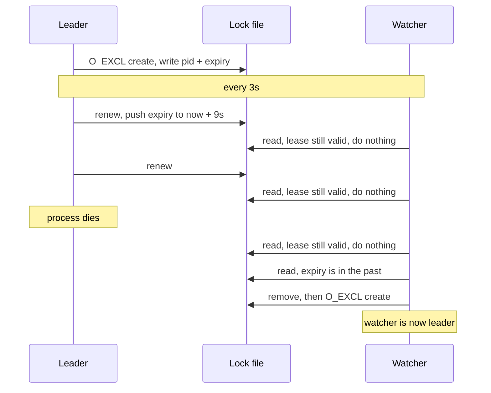

# Coordination Part 2: Processes on One Machine

In [Part 1](../coordination-part-1-thread-level/) we coordinated threads inside a single process, and every primitive we built rested on one assumption that was quietly doing all the work for us. Two goroutines could point at the same `counter` because they lived in one address space, and a mutex worked because both of them could see the same lock variable sitting in that shared memory.

Now we take that away, because we have two separate processes running on one machine and neither of them can see a single byte of the other's memory.

Every number below came from running the code, on Go 1.25.2 on an M-series Mac, and one of the experiments at the end turned up a genuine bug in the implementation that only shows up when we go looking for it.

---

## The mutex stops working, silently

The first thing worth noticing is how this failure presents itself. If we take the `safeCounter` from Part 1 and start it as two processes instead of two goroutines, nothing crashes and nothing warns us, because each process gets its own private copy of the counter and its own private copy of the mutex, and each one dutifully locks and unlocks a lock that no other process has ever heard of. Both of them report a perfectly correct 1,000,000 and neither of them coordinated with anything.

That is worse than the race in Part 1, where at least the number was visibly wrong. Here the mechanism is not merely broken, it is absent, and the code still looks like it is doing something.

The reason is that a mutex is a variable in memory, and process isolation means the operating system has given each process its own address space. So if we want a lock that two processes can share, it has to live somewhere that both of them can reach, and on a single machine the obvious shared thing is the filesystem.

---

## The lock file, and the same race all over again

The idea itself is simple enough, since a process that wants to be leader creates a file, and if that file already exists then somebody else got there first. Our first attempt more or less writes itself:

```go
if _, err := os.Stat(path); os.IsNotExist(err) {
    f, _ := os.OpenFile(path, os.O_CREATE|os.O_WRONLY, 0644)
    f.Close()
    fmt.Printf("[%d] I AM THE LEADER\n", pid)
}
```

To test it I launched 30 processes at once against a fresh lock file and counted how many of them declared themselves leader, then repeated that thirty times:

```
1 1 1 1 1 1 2 1 1 1 1 1 1 1 1 1 1 1 2 1 1 1 1 1 1 1 1 1 1 2

trials with more than one leader: 3 / 30   (max simultaneous leaders: 2)
```

Three times out of thirty we elected two leaders, which should look extremely familiar. We check whether the file exists and then we create it, and those are two separate steps with a gap in between, so two processes can both run the check, both see nothing there, and both go on to create. It is the flag from Part 1 wearing different clothes, and it fails for the identical reason.

It is also worth dwelling on the failure rate, because 3 out of 30 is exactly the shape of bug that gets shipped. Twenty seven runs out of thirty look perfect, so a test suite that runs this once and sees one leader will pass, and the same code under real load with slower disks and more processes will elect two leaders and corrupt something.

What we need is the filesystem equivalent of compare-and-swap, which is a create that either succeeds or fails, with no observable gap in the middle. POSIX gives us exactly that through the `O_EXCL` flag:

```go
f, err := os.OpenFile(path, os.O_CREATE|os.O_EXCL|os.O_WRONLY, 0644)
if err == nil {
    // we created it, so we are the leader
}
```

With `O_CREATE|O_EXCL` the open fails if the file already exists, and the check and the creation happen as one operation inside the kernel, because creating the inode is a single indivisible step at the filesystem level. That guarantee is a local one, and it is worth knowing that `O_EXCL` has historically been unreliable over NFS, which is precisely the setting where people reach for a lock file shared between machines. The layer below us usually keeps its promises, but it is a promise and not a law. Running the same thirty trials of thirty processes against this version:

```
1 1 1 1 1 1 1 1 1 1 1 1 1 1 1 1 1 1 1 1 1 1 1 1 1 1 1 1 1 1

trials that did not produce exactly one leader: 0 / 30
```

Exactly one winner, every time. This is the same lesson we learned at the thread level, which is that atomicity has to be handed to us by a lower layer, and all that has changed is which layer we are asking. Previously it was the CPU, and now it is the filesystem.

---

## The problem a mutex never had

So we have a working lock. Now let us kill the process holding it.

```bash
kill -9 <leader pid>
```

The lock file is still sitting there on disk, and it will sit there forever. No process is running that could delete it, nobody else can create it because `O_EXCL` correctly refuses, and the system is now permanently leaderless because of a lock held by a process that no longer exists.

This failure mode simply does not exist at the thread level. When a thread dies its process usually dies with it and takes the whole address space along, so there is nothing left to be stuck. Once we cross the process boundary, the holder of a lock can vanish while the lock survives it, and any design that ignores this will eventually wedge itself.

The fix is to stop treating the lock as something held indefinitely and start treating it as something that expires. That is a **lease**, which is a lock with a deadline attached, and it moves the responsibility around in a useful way. Instead of requiring the holder to release the lock, which a crashed process can never do, we require the holder to keep proving it is alive, and if it stops proving that then the lock becomes available on its own.

So the lock file stops being an empty marker and starts carrying content:

```json
{ "processId": 12345, "leaseUntil": 1715430000 }
```

Three intervals drive the whole thing:

- **LEASE_DURATION of 9 seconds**, which is how long the lease stays valid
- **RENEW_INTERVAL of 3 seconds**, which is how often the leader rewrites the expiry, and it has to be comfortably shorter than the lease
- **WATCH_INTERVAL of 3 seconds**, which is how often everybody else checks the file



The whole thing is one file, and it helps to have it open alongside this section.

Two notes on how the logs below were produced, because neither is what you get from a bare `go run`. The program prints RFC3339 timestamps, and I have replaced them with seconds elapsed since the processes started so that the intervals are easier to see. The committed program also contains a crash simulation that kills each process at a random point between 15 and 29 seconds, which is useful for watching the lifecycle unattended and ruinous for timing a specific failure, so I commented it out for every experiment here. Reproducing these numbers means doing the same.

*Full program: [`coordination/code/file-lock`](https://github.com/ajit3259/systems-and-layers/tree/main/coordination/code/file-lock)*

In steady state with three processes running, that produces a fairly boring log, which is what we want:

```
  3.53s [Process: 60217] [LEADER] Lease renewed, valid until 21:14:50
  3.53s [Process: 60222] [WATCHER] Lease held by 60217, valid until 21:14:47
  3.62s [Process: 60226] [WATCHER] Lease held by 60217, valid until 21:14:50
  6.53s [Process: 60217] [LEADER] Lease renewed, valid until 21:14:53
  6.53s [Process: 60222] [WATCHER] Lease held by 60217, valid until 21:14:50
  6.62s [Process: 60226] [WATCHER] Lease held by 60217, valid until 21:14:53
```

One leader renewing, two watchers waiting, and no coordination messages between the processes at all, because the file is doing all of the talking.

---

## Measuring the gap where nobody is in charge

Now we can kill the leader properly and time what happens, rather than reasoning about it from the constants. I killed process 60217 with `kill -9` at the 12 second mark. The third process, 60226, was watching throughout and its lines are cut here so the sequence stays readable:

```
  9.53s [Process: 60217] [LEADER] Lease renewed, valid until 21:14:56
 12.53s [Process: 60222] [WATCHER] Lease held by 60217, valid until 21:14:56
 15.53s [Process: 60222] [WATCHER] Lease held by 60217, valid until 21:14:56
 18.53s [Process: 60222] [WATCHER] Lease held by 60217, valid until 21:14:56
 21.53s [Process: 60222] [WATCHER] Lease held by 60217 expired at 21:14:56, attempting takeover
 21.53s [Process: 60222] [WATCHER] Takeover successful, now leader until 21:15:08
 21.62s [Process: 60226] [WATCHER] Lease held by 60222, valid until 21:15:08
```

The leader died at 12.00s and a new one took over at 21.53s, which leaves **9.53 seconds during which the system had no leader at all**. The watchers can see the lock file the whole time and they can see it is stale, but they will not touch a lease that has not expired yet, and they are right not to.

Pulling that number apart explains the shape of the tradeoff. The dead leader had renewed at 9.53s, which pushed its expiry out to 18.53s, so 6.53 seconds of the gap is lease time that was already paid for and is now being run down by a process that no longer exists. The remaining 3 seconds is the watch interval.

The log is more precise than that summary, and the detail is worth seeing. There is a watcher check at exactly 18.53s, the same instant the lease expired, and it decided the lease was still valid. The comparison is `content.LeaseUntil < time.Now().Unix()`, a strict less-than on whole seconds, so a lease expiring in the same second it is checked is not yet expired. The watcher went back to sleep and the takeover waited for the next tick at 21.53s. That is not a bug so much as an inevitability of comparing coarse timestamps, and it is the sort of off-by-one that turns a documented 9 second lease into a measured 9.53 second outage.

In the worst case the leader dies immediately after renewing and the expiry falls just after a watch tick, which gives us the full LEASE_DURATION plus WATCH_INTERVAL, or 12 seconds.

This is the **false leader window**, and the obvious reaction is to shrink the lease until it goes away. That does not work, because the lease duration is a bet on how long a healthy leader might be unable to renew while still being perfectly fine. A garbage collection pause, a slow disk, or a busy machine can all delay a renewal, and if the lease is shorter than that hiccup then a healthy leader gets evicted, a watcher takes over, and now two processes both believe they are in charge, which is considerably worse than having nobody in charge.

So the dial reads roughly like this. A long lease means slow failover but tolerance for a slow leader, while a short lease means fast failover but a real risk of evicting a leader that was only briefly busy. There is no setting that removes the gap, and the only thing that removes it is not crashing.

---

## Which is why graceful shutdown is worth the code

A crash is unavoidable, but most restarts are not crashes. Deployments, scale-downs and rolling restarts all send `SIGTERM` first, and that is a chance for the leader to hand the lock back on its way out:

```go
signal.Notify(sigChan, syscall.SIGTERM, syscall.SIGINT)
<-sigChan
if role == "renewal" {
    os.Remove(lockFileNamePath)
}
```

Running the same experiment but sending `SIGTERM` instead of `SIGKILL` at the 12 second mark:

```
 12.01s [Process: 60344] Received shutdown signal, releasing lease
 12.01s [Process: 60344] Lease released
 12.32s [Process: 60349] [LEADER] Acquired lease at 21:15:47, valid until 21:15:56
```

The gap is **0.31 seconds** instead of 9.53, and the only reason it is not zero is that the next watcher happened to tick 0.31 seconds later. The worst case here is one watch interval of 3 seconds, because the lock file is already gone and a watcher simply has to notice.

Roughly thirty times faster for about six lines of code, and the reason it works is that a released lease skips the expiry mechanism entirely. Watchers are not waiting out a clock, they are finding nothing there.

---

## The experiment that found a real bug

The last thing I wanted to test was what happens when a process dies at the worst possible instant, which here is the moment between creating the lock file and writing the lease into it, because acquisition is really these two steps:

```go
f, err := os.OpenFile(path, os.O_CREATE|os.O_EXCL|os.O_WRONLY, 0644)  // step 1
f.Close()
err = updateLeaseContent(path, &data)                                  // step 2
```

To simulate a crash in that gap I created an empty lock file by hand and started three processes against it:

```
  3.01s [Process: 63010] [WATCHER] Could not read lease file, will retry
  3.32s [Process: 63015] [WATCHER] Could not read lease file, will retry
  3.63s [Process: 63019] [WATCHER] Could not read lease file, will retry
  6.01s [Process: 63010] [WATCHER] Could not read lease file, will retry
  ...
 15.63s [Process: 63019] [WATCHER] Could not read lease file, will retry
```

That continues for as long as the processes live, which with the crash simulation commented out is forever. All three are alive and healthy, none of them ever becomes leader, and the system is wedged by a zero byte file.

The logic that traps them is reasonable-looking. A watcher that cannot parse the lease treats it as an opportunity and calls `tryAcquireLease`, which uses `O_EXCL`, which correctly fails because the file does exist. So the watcher logs a retry and loops, and it will keep doing that until somebody deletes the file by hand. There is no expiry to wait for, because an empty file has no expiry in it.

The root cause is one we have now hit three times in two posts. Create-and-write is two steps that needed to be one, so the same problem that broke the counter and then broke the naive lock has come back one layer up, and this time it survived because the window is small enough that ordinary testing never lands in it.

There are two honest fixes available, and both of them work by collapsing those two steps into one. We can make the write atomic by writing the content to a temporary file and then using `rename`, which is atomic on POSIX filesystems, so the lock file either does not exist or exists complete. Or we can move to a store where "set this key to this value with this TTL, but only if it does not exist" is a single operation, which is exactly what the alternatives below provide.

I am leaving the bug in the repository rather than quietly fixing it, because finding it is the most useful thing the experiment did.

---

## The takeover has a race in it too

There is one more gap worth naming. When a watcher decides a lease has expired, it removes the file and then creates it:

```go
os.Remove(lockFileNamePath)
f, err := os.OpenFile(lockFileNamePath, os.O_CREATE|os.O_EXCL|os.O_WRONLY, 0644)
```

If two watchers both notice the expiry at the same moment then both will try to remove, and one of them succeeds while the other gets an error, and then both race on the create. This one is actually safe, because `O_EXCL` decides the winner and the loser logs that it lost the takeover race and carries on watching. The correctness comes entirely from the atomic create, and the remove is just cleanup, but the difference between a gap that is fatal and a gap that is covered by an atomic operation further down is one to be able to see at a glance.

---

## The substrate is swappable

Almost nothing above is really about files. The disk was only being used as a place both processes could see, plus one atomic operation to arbitrate. Anything with those two properties works, and the lease logic of acquire, renew, watch, expire and take over stays identical:

**A lock file**, which is what we built, using `O_CREAT` together with `O_EXCL` as the atomic acquire. Its weakness is the one we found above, since creating the file and writing the lease into it are two separate steps.

**Redis**, where `SET key value NX PX 9000` acquires the key only if it does not exist and attaches a 9 second expiry in the same command. Because the value and the TTL are set in one operation, the empty file problem simply cannot happen.

**etcd or ZooKeeper**, which give us a compare-and-swap on a key along with a session TTL, and which push notifications to watchers instead of making them poll. That removes the watch interval entirely, so there is no 3 second detection lag on top of the expiry.

**A relational database**, where an `INSERT` against a unique constraint is the `O_EXCL` equivalent, and the expiry is just a timestamp column that a takeover query compares against.

Redis is the most instructive comparison, because `SET NX PX` collapses our two-step acquisition into one round trip and closes the exact hole that our empty file fell through.

---

## What carries forward

Everything at this level was the thread-level problem with two changes. The lock moved out of memory and onto a shared medium that both parties can reach, and the holder became something that can die while still holding it, which is what forced us into leases.

Part 1 ended on the observation that every hang in it was two steps that needed to be one. This post added two more instances without trying to, in the `stat` that checked and then created and the create that acquired and then wrote, and in both cases the repair was the same as it was for threads: find an operation at a lower layer that does both halves at once.

And the false leader window is our first taste of something that does not go away. At the thread level, correctness was achievable. Here, a hard crash guarantees a period where the system has no leader, and the only choices are how long that period is and what we risk by shortening it.

All of this still leaned on something, though. There is exactly one filesystem, both processes can see it, it answers immediately, and it never lies about what it holds. That single source of truth is what made a lock file sufficient.

In [Part 3](../coordination-part-3-distributed/) we remove it. Once the processes are on different machines there is no shared disk, the only way to ask a question is to send a message that may be delayed or lost or arrive out of order, and we can no longer tell the difference between a machine that has crashed and a machine that is merely slow to answer. That last one turns out to be the hard part.

---

*Runnable code for this post is in [Part 4: Hands-on](../coordination-part-4-hands-on/).*
