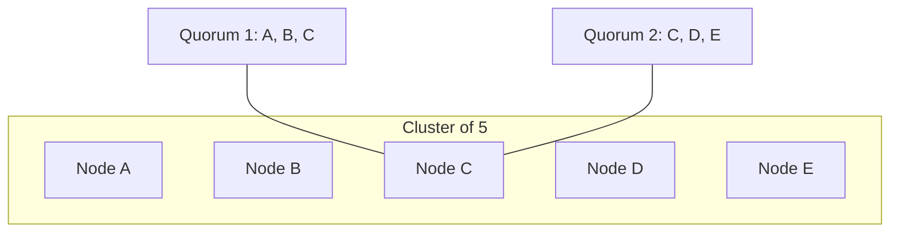

# Coordination Part 3: Machines on a Network

In [Part 1](../coordination-part-1-thread-level/) we coordinated threads through shared memory, and in [Part 2](../coordination-part-2-process-level/) we coordinated processes through a shared disk. Both of those worked because there was one thing in the middle that everybody could see, that answered immediately, and that never lied about what it was holding.

Now the processes are on different machines, and the only way one of them can learn anything about another is to send a message and wait.

**A note on what the code here is.** The simulation in this post follows Raft's core ideas, which are terms, randomized election timeouts, majority voting and stepping down on a higher term, but it is a teaching implementation and not an implementation of Raft. Nothing is persisted to disk, the log exists as a structure but nothing is ever replicated into it, the cluster is hardcoded at three nodes, and the network is a set of in-process Go channels. Anywhere the two differ, the paper is right and this code is a simplification. The specification worth reading is the extended Raft paper at [raft.github.io](https://raft.github.io), particularly its Figure 2.

Everything below was run on Go 1.25.2 on an M-series Mac, and the simulation did not survive its own crash test the first time, which turned out to be the most useful thing in the post.

---

## The one question we can no longer answer

Our lease in Part 2 rested on a fact so ordinary that it was easy to miss. When a watcher read the lock file, it got the truth, and it got it immediately. If the file said the lease expired eight seconds ago then that was simply true, and the watcher could act on it.

Over a network we lose that. A node sends a message to the leader and no reply comes back, and the possible explanations are that the leader has crashed, or that the leader is alive and the request is still in flight, or that the leader answered and the reply was lost, or that the leader is alive and healthy but a switch between us has failed. From where the sender is standing, all four of these look identical, because all four are just silence.

This is the single fact that makes distributed coordination hard, and it deserves stating on its own. **We cannot distinguish a machine that has crashed from a machine that is slow or unreachable.** Everything else in this post is a consequence.

The temptation is to solve it with a timeout, since if there is no answer within some deadline we declare the node dead. But a timeout does not detect death, it only converts silence into a guess, and we can be wrong in both directions. If we guess too eagerly then we declare a healthy leader dead and elect a second one, and now two nodes think they are in charge. If we wait too long then the system sits unavailable while a genuinely dead leader is mourned.

We saw a small version of this in Part 2 with the lease duration, but there the disk was a reliable witness that both processes trusted. Here there is no witness at all, and every node has only its own local view.

---

## What the network is allowed to do to us

Before designing anything, it helps to be precise about what can go wrong, because each of these breaks a different assumption we have been making for two posts:

- **Messages are delayed**, so information arrives describing a world that has already moved on.
- **Messages are lost**, so a decision may be made by some nodes and never learned by others.
- **Messages arrive out of order**, so a node can hear about a later event before an earlier one.
- **Nodes crash and restart**, so a node can come back with no memory of what it agreed to, unless it wrote that down first.
- **The network partitions**, so two groups of nodes each remain healthy internally while being unable to reach each other, and neither group can tell whether the other is dead or merely unreachable.
- **Clocks disagree**, so we cannot order events across machines by looking at timestamps, and wall clocks can jump backwards.

That last one deserves a note, because our Part 2 lease was built entirely on timestamps. It worked because one machine's clock was compared against itself. Across machines that reasoning collapses, and this is why the algorithm below never compares wall clock times and uses a counter instead.

---

## Why we cannot simply solve this

There is a result that tells us how far we can get, and knowing it early saves a lot of wasted effort. The [**FLP impossibility**](https://en.wikipedia.org/wiki/Consensus_(computer_science)) result, named after Fischer, Lynch and Paterson, shows that in an asynchronous network, where messages can be delayed arbitrarily, no deterministic algorithm can guarantee that a group of nodes reaches agreement if even one of them may fail.

The intuition is the ambiguity we started with. Since a slow node and a dead node are indistinguishable, any algorithm must either wait forever for a node that may be dead, which means it may never terminate, or eventually proceed without that node, which means it may be excluding a node that was only slow and is about to disagree.

This sounds like it ends the discussion, but it does not, because the result is about *guarantees* under *adversarial* timing. What it forbids is an algorithm that always terminates in bounded time no matter how the delays are arranged. What it permits is an algorithm that is always correct and that terminates with probability one under any timing that is not actively conspiring against us.

That is the escape hatch every practical consensus system uses, and Raft's version of it is randomized election timeouts. If two nodes propose themselves at the same instant then neither wins, and both wait for a fresh random interval before trying again, which makes a repeat collision progressively less likely. We do not eliminate the bad case, we make it vanishingly improbable and we make sure it is never *incorrect*, only slow.

---

## Majorities, and why they are enough

If we cannot wait for everybody, how many nodes do we need before acting? The answer is a **majority**, meaning `floor(n/2) + 1`, which is 2 out of 3, or 3 out of 5. A set of nodes large enough to act on its own is called a **quorum**, and for everything in this post a quorum is exactly a majority.

The reason a majority is the right threshold is one property, and it is easier to see than to state. **Any two majorities of the same set must overlap in at least one member.** Two subsets of a five node cluster that each contain three nodes cannot be disjoint, because that would need six nodes.



That guaranteed overlap has a name, **quorum intersection**, and it is what makes majorities useful, because the shared member is a witness. If some decision was accepted by a majority, then any future majority contains at least one node that saw it, so a new leader that collects votes from a majority is guaranteed to encounter anybody who knew about the old decision. Agreement survives across leadership changes without any node having to be permanently special.

This also explains why cluster sizes are odd. A cluster of four tolerates exactly one failure, because a majority is three, which is the same tolerance a cluster of three gives us. The fourth node adds cost and coordination without adding fault tolerance.

And it explains what happens during a partition. At most one side of any split can hold a majority, so at most one side can continue making decisions, and the minority side must stop even though every node in it is perfectly healthy.

---

## Which brings us to CAP

That last paragraph is the intuition behind the [CAP theorem](https://en.wikipedia.org/wiki/CAP_theorem), which as a formal result is a narrower statement about linearizable registers under an asynchronous partition. The intuition is the part we can derive rather than memorize. The usual statement is that a system can have at most two of consistency, availability and partition tolerance, which is misleading, because it invites us to think all three are on the menu.

Partitions are not a design choice. Networks fail, cables get unplugged and switches die, and the only way to opt out of partition tolerance is to have a single machine, at which point we are not discussing a distributed system. So partition tolerance is a fact we are handed, and the real question is what we do while a partition is happening.

Once we frame it that way there are only two answers available. We can keep serving the minority side, which means two sides may accept conflicting writes and we have given up consistency. Or we can refuse to serve the minority side, which keeps the data consistent and means those nodes are unavailable even though they are running fine. Raft picks the second, so a minority partition stops accepting writes and waits, and the cluster is consistent and unavailable rather than available and divergent.

---

## The ideas the simulation actually implements

With majorities in hand, the remaining problem is choosing one leader per period of time in a way that everybody eventually agrees on. Raft's answer rests on four ideas, and these are the ones our code follows.

**Terms are a logical clock.** Rather than comparing wall clocks across machines, which we established is hopeless, every election increments a counter. A term is a period with at most one leader, and every message carries the term it was sent in, so a node receiving a message from an older term knows it is stale and ignores it, and a node receiving a message from a newer term knows its own view is out of date. In our code that reaction is a single helper, and every path that learns of a higher term calls it:

```go
func stepDown(node *NodeState, newTerm int64) {
	node.role = Follower
	node.currentTerm = newTerm
	node.votedFor = ""
	node.votes = 0
	node.votesFrom = make(map[string]bool)
}
```

**Elections start from silence and use randomized timeouts.** A follower that has not heard from a leader within its election timeout, which here is `3 + rand.Intn(3)` seconds and so is 3, 4 or 5, assumes there is no leader, increments the term, votes for itself and asks everybody else for a vote. The randomization is what breaks ties, since two nodes that collide will almost certainly pick different intervals on the next attempt.

**A leader announces itself by repeating itself.** Once elected, a leader sends every other node a **heartbeat** on a fixed interval, once a second in our code. A heartbeat carries the leader's term and no other content, and its only job is to reset the followers' election timers. Silence, meaning the absence of these, is the only evidence a follower ever has that the leader is gone.

**A node votes at most once per term.** This is what stops two candidates both collecting a majority in the same term, and it is why `votedFor` has to be remembered rather than recomputed.

**A vote is only granted to a candidate whose log is at least as complete as our own.** This is the part that makes the mechanism safe rather than merely decisive:

```go
isLogUpToDate := voteRequest.lastLogTerm > lastLogTerm ||
	(voteRequest.lastLogTerm == lastLogTerm && voteRequest.lastLogIndex >= int64(len(node.log)))
if isLogUpToDate && (node.votedFor == "" || node.votedFor == voteRequest.candidateId) {
```

The term check asks whether this election is legitimate, and the log check asks whether this candidate is safe to follow, and both have to pass.

Put that together with quorum intersection and we get the property called **leader completeness**. An entry is **committed** once a majority of nodes have stored it, which is the point at which the cluster may tell a client the write succeeded. A candidate cannot win without votes from a majority. Any two majorities overlap, so the voters who elected the new leader must include at least one node that already holds every committed entry. That node would have refused to vote for a candidate whose log was behind it. So whoever wins is guaranteed to hold every committed entry already, which is why a new leader can start serving immediately instead of reconstructing history first.

One caveat about the snippet above, since it is easy to over-read. Our log is never written to, so `len(node.log)` is always zero and the up-to-date test always passes. The comparison also uses a length where real Raft uses the index of the last entry. Both sides use lengths so it is self-consistent, but this is the shape of the check rather than a working version of it.

---

## Running it, and watching it fail

The simulation starts three nodes, each with an inbox channel, and crashes node 0 after ten seconds by cancelling its context. It is spread across three files, with the message types in `messages.go`, the node state in `node.go`, and the event loop in `main.go`.

*Full program: [`coordination/code/raft`](https://github.com/ajit3259/systems-and-layers/tree/main/coordination/code/raft)*

The first part goes exactly as intended:

```
  3.63s [Node 2] Election timeout, starting election for term 1
  3.63s [Node 1] [Term 0] Received VoteRequest from 2 for term 1
  3.63s [Node 0] [Term 0] Received VoteRequest from 2 for term 1
  3.63s [Node 2] [Term 1] Won election, becoming LEADER
  4.63s [Node 1] [Term 1] Heartbeat from leader 2
  4.63s [Node 0] [Term 1] Heartbeat from leader 2
```

One election, one leader, no split vote, and steady heartbeats afterwards. Then node 0 is crashed at 10.63 seconds, and for a while nothing seems wrong, because node 0 was a follower and a cluster of three survives losing one member. Heartbeats to node 1 continue normally for another nine seconds.

And then the whole thing stops:

```
 19.63s [Node 1] [Term 1] Heartbeat from leader 2
 22.63s [Node 1] Election timeout, starting election for term 2
 22.63s fatal error: all goroutines are asleep - deadlock!

goroutine 39 [chan send]:
main.sendHeartbeats(...)
	.../raft/main.go:45 +0x210
```

That is the same `fatal error` we met at the end of Part 1, now appearing in a consensus implementation, and the trace points at the line where the leader sends a heartbeat.

**What actually happened.** When node 0's context was cancelled, its `runNode` loop returned, so nothing drains its inbox any more. The leader does not know that and keeps sending heartbeats once a second, and the inbox is a buffered channel with room for ten messages. After ten heartbeats it is full, and the eleventh send blocks. Since `sendHeartbeats` is a plain blocking send, the leader now stops sending heartbeats to anybody, so node 1 stops hearing from it, times out, and starts an election for term 2, at which point it tries to send a vote request to node 0 and blocks on the same full inbox. Every goroutine is now waiting on a channel that nobody will ever read, and the runtime notices.

The bug is not really in the election logic, it is in the transport. A blocking channel send models a network that will wait patiently forever for a machine that no longer exists, and no real network behaves that way. When we send a packet to a dead machine, the packet is dropped, and the sender carries on.

So the fix is to make the simulated network behave like a network:

```go
// send delivers a message without blocking. A full inbox models a node that is
// gone or unreachable, and a real network drops the packet rather than waiting.
func send(ch chan Message, msg Message) {
	select {
	case ch <- msg:
	default:
	}
}
```

With every send routed through that, the crash behaves the way it should:

```
  3.01s [Node 0] Election timeout, starting election for term 1
  3.01s [Node 0] [Term 1] Won election, becoming LEADER
 10.01s --- Crashing Node 0 ---
 13.01s [Node 2] Election timeout, starting election for term 2
 13.01s [Node 1] [Term 1] Received VoteRequest from 2 for term 2
 13.01s [Node 2] [Term 2] Won election, becoming LEADER
```

The leader dies, a follower notices the silence, the term advances from 1 to 2, and the remaining two nodes elect a new leader between themselves, which is a majority of three and therefore enough.

This fix is in the committed code, so reproducing the deadlock now means replacing the `send` helper with a direct channel send, which is worth doing once because watching it wedge is more convincing than reading about it.

To get a sense of how long failover takes I ran the simulation 44 times, of which 13 were runs where node 0 happened to win the first election, so that crashing it was a genuine leader crash. Failover took between 3 and 11 seconds with a median of 4, and 8 of those 13 resolved in a single election while the other 5 needed more than one. That is a small sample and the spread is wide, so treat it as a rough shape rather than a benchmark.

Fixing the transport exposed a second problem worth mentioning, because the series has already made a fuss about it. `sendHeartbeats` originally ran as its own goroutine while reading `node.role` and `node.currentTerm`, which `runNode` writes from a different goroutine, with no mutex and no channel between them. That is unsynchronized shared mutable state, which is the thing Part 1 opens with. The race detector never complained, because in this particular scenario a live leader never steps down and the conflicting write never fires, which makes it latent rather than harmless. The repair was not to add a lock but to stop sharing, so heartbeats are now sent from `runNode`'s own select loop and exactly one goroutine touches a node's state.

To be clear, both of these were bugs in the simulation rather than discoveries about Raft, but the lesson generalizes anyway. Distributed algorithms are usually described as if the network were a given, and a great deal of the difficulty in building them lies in whether the transport underneath does what the description assumed.

---

## When two candidates collide

The eighth run is the interesting one, because it took 8 seconds instead of 3, and the log shows why:

```
 10.47s --- Crashing Node 0 ---
 14.47s [Node 2] Election timeout, starting election for term 2
 14.47s [Node 1] Election timeout, starting election for term 2
 14.47s [Node 1] [Term 2] Received VoteRequest from 2 for term 2
 14.47s [Node 2] [Term 2] Received VoteRequest from 1 for term 2
 18.47s [Node 1] Election timeout, starting election for term 3
 18.47s [Node 2] [Term 2] Received VoteRequest from 1 for term 3
 18.47s [Node 1] [Term 3] Won election, becoming LEADER
```

Both surviving followers timed out at the same instant, so each incremented to term 2 and voted for itself, and each then refused the other because a node votes at most once per term. Neither reached a majority of two, term 2 produced no leader at all, and the cluster sat leaderless until node 1 timed out again and won term 3.

This is exactly the case randomized timeouts exist to handle, and notice that the mechanism did not prevent the collision, it only made it temporary. Term 2 was wasted but nothing incorrect happened, and the retry used fresh random intervals so the two nodes did not collide a second time. Safety was never at risk, only speed, which is the tradeoff FLP forces on us.

I got this wrong on the first pass and the correction is instructive. My first measurement ran twelve copies of the simulation at once on one laptop, and the three leader-crash runs in that batch all needed a second election, so I wrote that CPU contention was causing the split votes. Running only four copies at a time still produced split votes in 5 of 13 runs, which means they happen perfectly well on an unloaded machine, and three runs was never enough to support a claim about cause. What I can say is that the collision is a plain race between two random timers, so anything that delays heartbeats gives that race more chances to occur.

That connects to a real operational failure. When a cluster is overloaded, heartbeats are delayed, followers time out on a leader that is alive and merely busy, and elections begin. Those elections consume resources on an already struggling cluster, which delays heartbeats further, so load causes elections and elections cause load. It is a well known way for a database cluster to fall over under pressure.

---

## What this code does not do

The election mechanism above is the part of Raft our simulation follows. These are the parts it does not, and each of them matters in a real system.

**Nothing is written to disk.** Raft requires that `currentTerm`, `votedFor` and the log are flushed to stable storage before a node replies to anything, because the whole safety argument assumes a node that restarts remembers what it promised. If a node votes for a candidate, crashes, restarts with no memory and votes again in the same term, two leaders can be elected in one term and the guarantee is gone. Our nodes hold all of this in memory only, so they are not crash-safe in the way the paper requires.

**There is no log replication.** The `log` field exists and the vote check compares log lengths, but nothing is ever appended, so every log is empty and the up-to-date test always passes trivially. Everything interesting about Raft lives in replication, including how a leader brings a lagging follower back into line, and what it means for an entry to be committed once a majority has acknowledged it.

**The cluster is fixed at three nodes** with no support for adding or removing members, which in the real protocol is delicate enough to have its own section in the paper.

**The network is a set of in-process channels**, so messages are never reordered, never duplicated, and are only dropped in the specific case we introduced above. A real transport does all three, constantly.

None of this makes the simulation useless, because watching a term advance and a new leader emerge from silence is exactly the intuition worth having. It does mean the honest description is that we followed Raft's ideas, and that anybody building the real thing should work from Figure 2 of the paper rather than from this.

---

## What carries forward

Each rung took away one thing we had been leaning on, and the interesting part is what had to change in response.

Losing shared memory cost us the ability to hold a lock indefinitely, because a process can die while the lock survives it, so the lock had to grow an expiry date. Losing the shared disk cost us the ability to trust an answer at all, because silence from a machine is not evidence of anything, so we stopped asking one authoritative place and started asking enough places that any two answers must overlap. That is the sentence I would keep out of all three posts: a quorum is what atomicity looks like when there is no shared substrate left to appeal to.

The send that assumed a receiver still existed was the last instance of the pattern Part 1 ended on, and by now it should look familiar enough to spot before it bites.

[Part 4](../coordination-part-4-hands-on/) has the runnable code for all three levels, along with what to look for when running each one.
