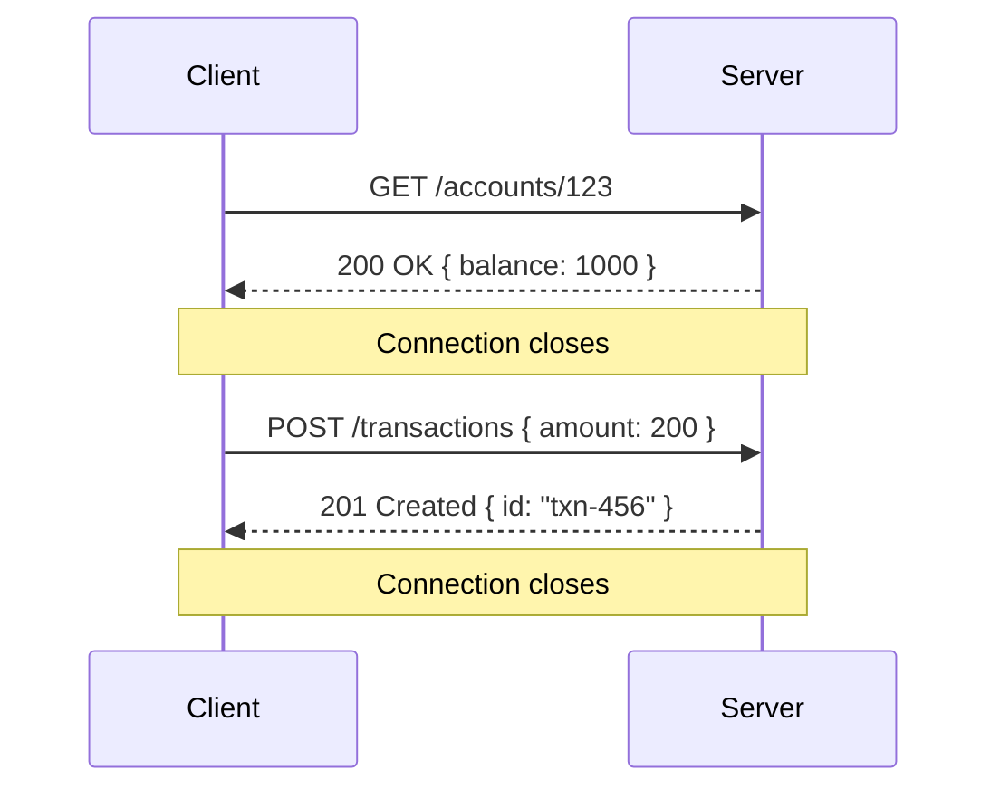
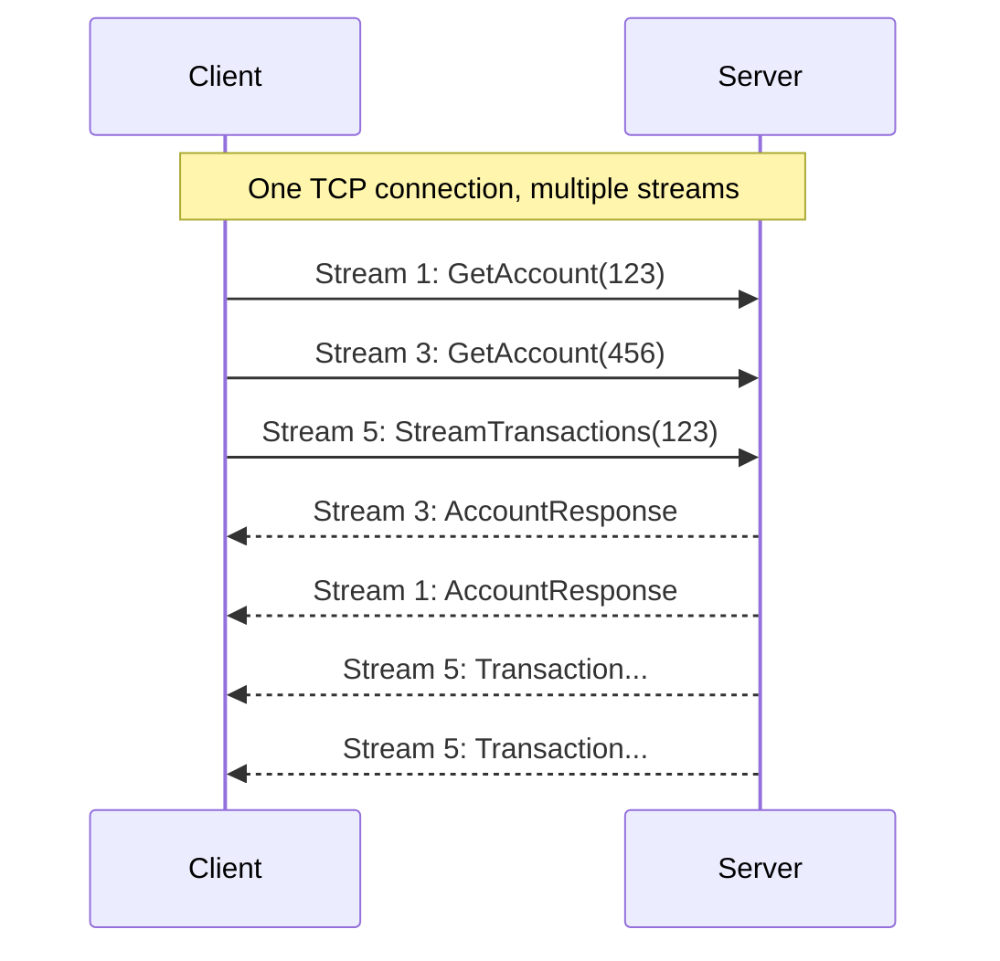
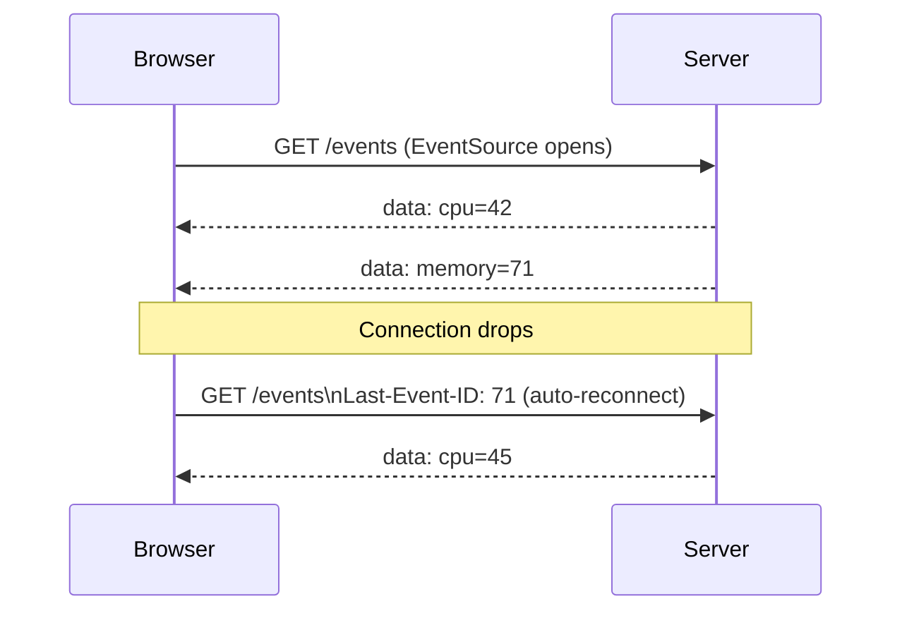
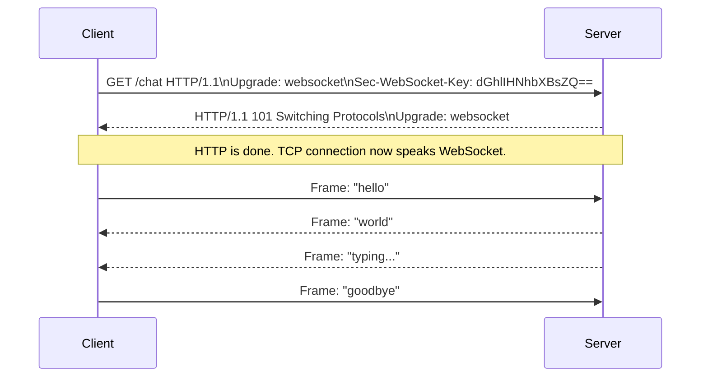
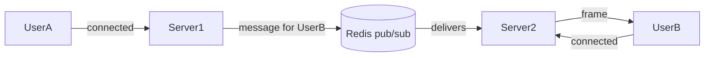
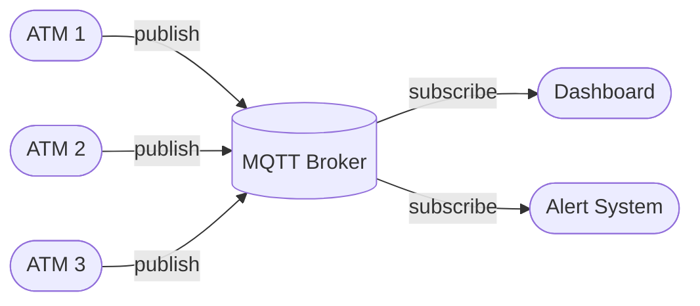
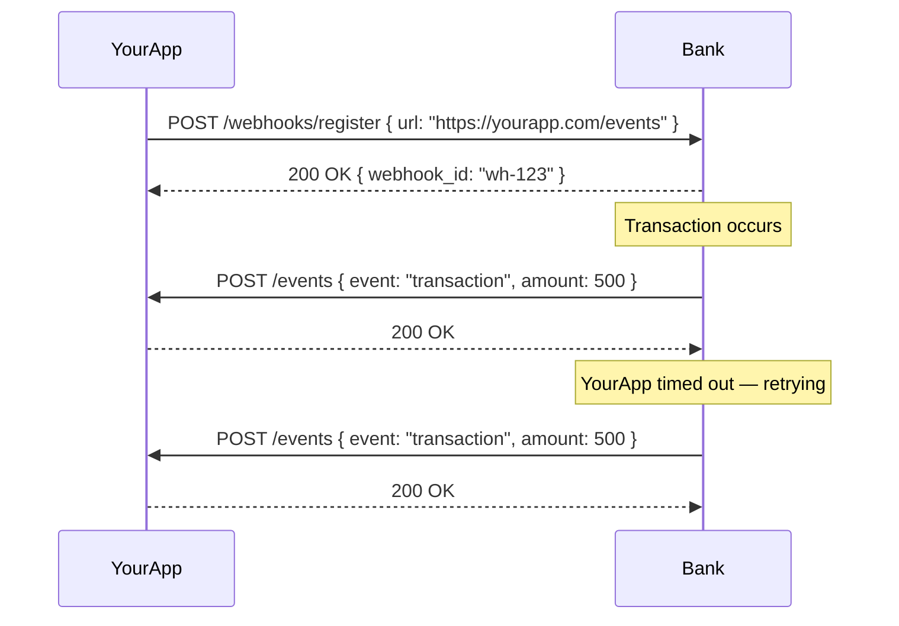
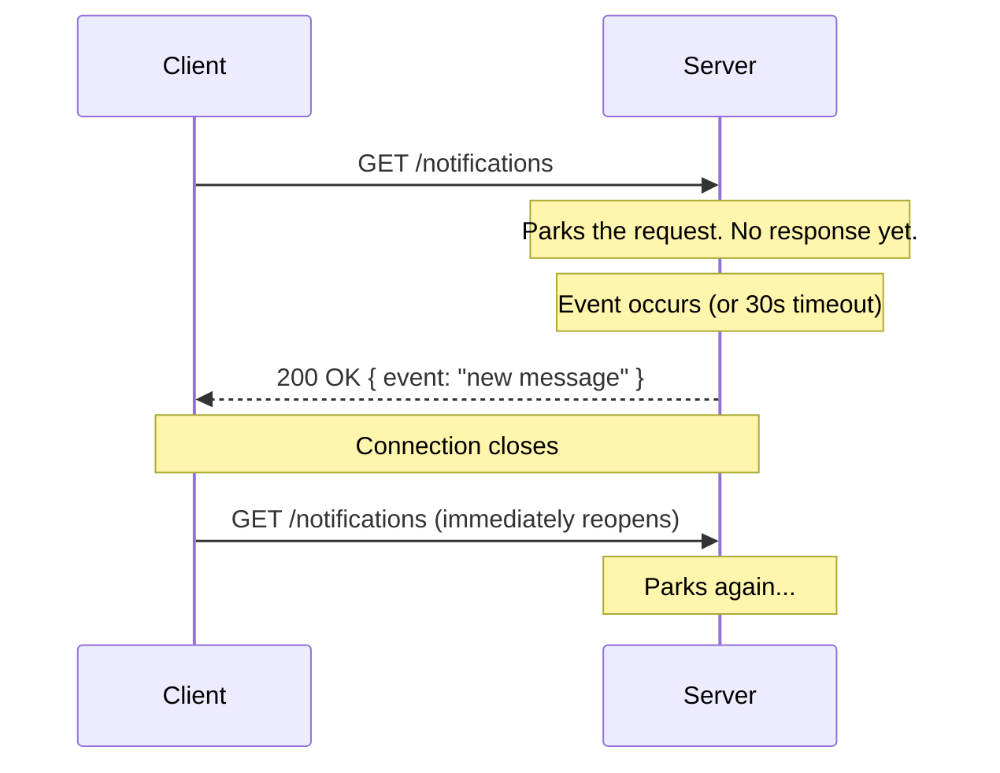

# API Patterns — Part 2: Under the Hood

← [Part 1: The Decision Framework](./) 

Part 1 gave you the decision framework — which style to reach for given a set of requirements. This part explains why each one works the way it does. Understanding the mechanics is what lets you debug unexpected behavior, make the right call in edge cases, and defend your choices when someone pushes back.

---

## REST

### How it works

REST is not a protocol — it's an architectural style that runs on top of HTTP. Roy Fielding defined it in his 2000 dissertation with six constraints. The one that shapes everything else is the **Uniform Interface**: resources are nouns, HTTP verbs are actions.

```
GET    /accounts/123          → fetch account
POST   /transactions          → create transaction
PUT    /accounts/123          → replace account
PATCH  /accounts/123          → partial update
DELETE /accounts/123/cards/1  → delete a card
```

HTTP gives you idempotency for free: GET, PUT, DELETE are idempotent — calling them multiple times produces the same result. POST is not.



Each request is independent. The server holds no memory between them — this is statelessness. Any server instance can handle any request, which is why REST scales horizontally without coordination.

**Caching** is one of REST's strongest operational advantages. GET responses cache at the browser, CDN, and reverse proxy level with zero configuration:

```
Cache-Control: max-age=3600
ETag: "abc123"
```

No other style in this guide gets this for free.

### Strengths
- Stateless → horizontally scalable, no coordination between instances
- HTTP caching works out of the box at every layer
- Works with every HTTP client — browser, curl, Postman, mobile
- Human-readable JSON, easy to debug

### Weaknesses
- Over-fetching — server defines response shape, client gets fields it doesn't need
- Under-fetching — related data requires multiple round trips
- No enforced contract — breaking changes are silent without OpenAPI
- No first-class streaming

---

## gRPC

### How it works

gRPC is built on two things: **Protocol Buffers** for serialization and **HTTP/2** for transport. Understanding both is understanding gRPC.

**Protocol Buffers**

You define your service in a `.proto` file:

```protobuf
syntax = "proto3";

service AccountService {
  rpc GetAccount(AccountRequest) returns (AccountResponse);
  rpc StreamTransactions(AccountRequest) returns (stream Transaction);
}

message AccountRequest { string account_id = 1; }
message AccountResponse {
  string account_id = 1;
  int64 balance = 2;
}
```

The compiler generates client and server code in your language. Both sides work from the same contract. A field rename or type change breaks compilation — you catch it before it reaches production.

Protobuf encodes messages as binary. A field is not `"balance": 1000` (10 bytes) — it's a field number (1 byte) + varint value. The same data is 3–10x smaller and faster to parse than JSON.

**HTTP/2 multiplexing**

HTTP/1.1 sends one request at a time per connection. If request 1 is slow, request 2 waits — this is head-of-line blocking. HTTP/2 introduces streams: multiple logical conversations over one TCP connection, interleaved.



Three concurrent RPCs, one connection, no blocking. This is why gRPC has better throughput than REST over HTTP/1.1 for high-frequency internal calls.

**Streaming types**

gRPC exposes four interaction patterns:

```
Unary             → client sends one, server responds once
                    rpc GetAccount(Request) returns (Response)

Server streaming  → client sends one, server streams many back
                    rpc StreamTransactions(Request) returns (stream Transaction)

Client streaming  → client streams many, server responds once
                    rpc UploadLogs(stream LogEntry) returns (Summary)

Bidirectional     → both sides stream simultaneously
                    rpc LiveSupport(stream Message) returns (stream Message)
```

### Strengths
- Binary (protobuf) → 3–10x smaller payload, faster parse
- HTTP/2 multiplexing → high throughput, no head-of-line blocking
- Strict contract → breaking changes caught at compile time
- First-class streaming in all directions
- Code generation → type-safe clients in multiple languages

### Weaknesses
- No native browser support — needs gRPC-Web proxy
- Binary is hard to debug — you can't curl and read the response
- Schema distribution — every consumer needs the `.proto` and must run codegen
- Every call is a POST — HTTP caching doesn't apply
- Overkill for simple CRUD

---

## GraphQL

### How it works

GraphQL is a query language for APIs. The client describes the shape of data it wants; the server returns exactly that shape.

**The schema**

The server defines a typed schema:

```graphql
type Account {
  id: ID!
  balance: Int!
  transactions: [Transaction!]!
}

type Transaction {
  amount: Int!
  merchant: Merchant
}

type Query {
  account(id: ID!): Account
}
```

**The query**

The client sends a query declaring exactly what it needs:

```graphql
query {
  account(id: "123") {
    balance
    transactions {
      amount
      merchant { name }
    }
  }
}
```

The server traverses a tree of resolvers — functions that fetch each field. This is where the N+1 problem lives.

**The N+1 problem**

```
account resolver      → SELECT * FROM accounts WHERE id = '123'
transactions resolver → SELECT * FROM transactions WHERE account_id = '123'
                        → returns [txn1, txn2, txn3]
merchant resolver     → SELECT * FROM merchants WHERE id = 'm1'
merchant resolver     → SELECT * FROM merchants WHERE id = 'm2'
merchant resolver     → SELECT * FROM merchants WHERE id = 'm3'
```

One GraphQL query triggers N+1 database calls. The fix is **DataLoader** — a batching layer that collects all merchant IDs requested in one event loop tick and fires a single query:

```
SELECT * FROM merchants WHERE id IN ('m1', 'm2', 'm3')
```

DataLoader is not built into GraphQL. You wire it up yourself.

**Operations**

```
query        → read data
mutation     → write data
subscription → real-time push, typically over WebSocket
```

**Caching problem**

REST GET requests cache at CDN and browser level. GraphQL queries go as POST — query in the request body — so HTTP caching doesn't apply. You need application-level caching. DataLoader provides per-request caching; persisted queries help at the CDN level.

### Strengths
- Client controls response shape — eliminates over-fetching and under-fetching
- Traverse relationships in one request — eliminates multiple round trips
- Typed schema shared between client and server
- Subscriptions for real-time data

### Weaknesses
- N+1 query problem — requires DataLoader
- HTTP caching broken by default
- Learning curve — schema design, resolver trees, DataLoader wiring
- Overkill for most APIs
- JSON only — no binary option

---

## SSE (Server-Sent Events)

### How it works

SSE is not a new protocol. It's a convention on plain HTTP: the server sends a response that never ends.

The client opens a connection:
```
GET /events HTTP/1.1
Accept: text/event-stream
```

The server responds with a streaming body:
```
HTTP/1.1 200 OK
Content-Type: text/event-stream
Cache-Control: no-cache

data: {"metric": "cpu", "value": 42}\n\n
data: {"metric": "cpu", "value": 44}\n\n
data: {"metric": "memory", "value": 71}\n\n
```

Two newlines (`\n\n`) mark the end of each event. The connection stays open. The server writes events as they happen.

**EventSource and auto-reconnection**

The browser's `EventSource` API handles SSE natively:

```javascript
const source = new EventSource('/events');
source.onmessage = (event) => console.log(event.data);
```

If the connection drops, `EventSource` automatically reconnects and sends `Last-Event-ID` so the server knows where to resume. Fault tolerance for free — no reconnection logic to write.



**The connection limit**

HTTP/1.1 allows 6 connections per domain — shared across everything on that domain. SSE holds a connection open permanently, consuming a slot that REST calls also need. The fix: multiplex multiple logical streams over one SSE connection, routing by event type. HTTP/2 removes this limit entirely.

### Strengths
- Plain HTTP — works through all proxies, CDNs, load balancers
- Auto-reconnection with resume built into EventSource
- No extra infrastructure needed to scale (stateless server)
- Simple to implement — just a long HTTP response
- Human-readable, easy to debug

### Weaknesses
- Server → client only
- Text only — no binary data natively
- HTTP/1.1: 6-connection limit per domain shared with REST calls
- No built-in backpressure — server writes, client buffers; silent data loss if server produces faster than client can process (rarely the binding constraint for typical SSE use cases like tokens or metrics)

---

## WebSocket

### How it works

WebSocket starts as HTTP then leaves it behind entirely.

**The upgrade handshake**



After `101 Switching Protocols`, the TCP connection is still open but the protocol has changed. Messages are sent as **frames** — lightweight binary envelopes with a 2–14 byte header and a payload.

**You define the protocol**

WebSocket gives you a raw channel. No verbs, no status codes, no caching. You design your own message format:

```json
{ "type": "message", "id": "msg-1", "text": "hello", "from": "user-123" }
{ "type": "typing", "from": "agent-456" }
{ "type": "delivered", "id": "msg-1" }
```

If you need request-response correlation inside WebSocket, implement it yourself with message IDs.

**The scaling problem**

Each WebSocket connection is a stateful socket tied to one server instance. In a horizontally scaled system:



Server 1 can't reach UserB's connection on Server 2 directly. The fix is a shared pub/sub layer like Redis — all server instances publish and subscribe through it. Alternatively, sticky sessions route a user to the same instance always, but that creates uneven load and complicates failover.

### Strengths
- Full-duplex — both sides send simultaneously, independently
- Low latency per message — no HTTP headers per message after handshake
- Custom protocol flexibility — you define the communication contract
- Near-zero delay for real-time applications

### Weaknesses
- Stateful → sticky sessions or Redis pub/sub to scale
- No auto-reconnection — implement yourself with exponential backoff
- Proxy and firewall issues — some corporate infrastructure drops long-lived connections
- Lose all HTTP semantics — no caching, no status codes, no idempotency
- Resource heavy — one open socket per connected client

---

## MQTT

### How it works

MQTT runs directly over TCP, not HTTP. Its entire design optimizes for constrained environments — low bandwidth, unreliable connections, limited CPU.

**The topology**



Publisher and subscriber never know about each other. The broker routes messages by topic.

**Topics and wildcards**

Topics are hierarchical strings:

```
atms/us-east/atm-1042/cash-level   → specific ATM, specific metric
atms/us-east/atm-1042/#            → all metrics from one ATM
atms/us-east/#                     → all ATMs in us-east
atms/#                             → everything
```

One subscriber line covers thousands of devices.

**QoS levels**

MQTT makes delivery guarantees explicit — you choose per message:

| Level | Guarantee | Cost |
|---|---|---|
| 0 | Fire and forget — may be lost | Minimal |
| 1 | At least once — ack required, may duplicate | Low |
| 2 | Exactly once — four-way handshake | Higher |

For ATM cash level readings, QoS 0 is fine — a missed reading is no problem. For a transaction confirmation, QoS 2 is appropriate.

The smallest valid MQTT packet is 2 bytes. HTTP headers alone are hundreds of bytes. On satellite links billed per kilobyte, this difference is real.

### Strengths
- Minimal overhead — 2-byte minimum packet
- Designed for unreliable, intermittent connections
- Explicit QoS levels — you choose the delivery guarantee per message
- Wildcard subscriptions — one line covers thousands of devices
- Decoupled topology — publisher and subscriber isolated from each other

### Weaknesses
- Broker is a single point of failure — requires its own HA setup
- No native browser support — needs MQTT over WebSocket
- Not designed for request-response patterns
- Operational complexity — broker infrastructure to manage

---

## Webhooks

### How it works

Webhooks invert the polling model. Instead of your system asking "anything new?", the source system calls you when something happens.



**Delivery and idempotency**

Webhook senders retry on failure. The same event may arrive more than once. Your handler must be idempotent — processing the same event twice should produce the same result.

A reliable pattern: verify the signature (HMAC), write the raw event to a queue immediately, return 200, process asynchronously. This keeps your handler fast and makes retries safe.

### Strengths
- Event-driven — no wasted polling requests
- Simple infrastructure — just an HTTP endpoint
- Works server-to-server across the internet
- Widely supported (Stripe, GitHub, Twilio all use this model)

### Weaknesses
- Your server must be publicly reachable
- Events can arrive out of order
- Must handle duplicates — idempotency is your responsibility
- Hard to test locally without tunneling tools like ngrok

---

## Polling

### Short polling

Client asks on a fixed interval. Simple, works everywhere, works with plain REST. Wasteful — most requests return nothing.

```
every 5 seconds:
  GET /notifications → "nothing"
  GET /notifications → "nothing"
  GET /notifications → "you have a message"
```

Use when delay is acceptable and simplicity matters more than efficiency.

### Long polling

Client asks, server holds the connection open until something happens or a timeout fires:



Each cycle is a new HTTP request — not the same connection reused. The server holds the response by suspending the handler; in async servers no thread is blocked while waiting.

Near-real-time delivery, no special infrastructure, works through all proxies. More resource-intensive than SSE for the same use case, but useful as a fallback when SSE isn't available.

---

## Streaming — a unified view

Streaming means data flows incrementally over a connection rather than waiting for a complete payload. Three directions:

```
Server → Client    SSE, WebSocket, gRPC server streaming
Client → Server    WebSocket, gRPC client streaming, HTTP chunked upload
Both directions    WebSocket, gRPC bidirectional streaming
```

**When streaming matters:**

Data is too large to buffer whole:
```
Video upload      → stream chunks to server, don't hold entire file in memory
Large DB export   → stream rows as cursor reads, don't load 1M rows at once
```

Results arrive over time:
```
LLM generation    → stream tokens as generated, don't wait 10s for full response
Long-running job  → stream progress updates to the client
```

**Multipart upload vs streaming**

These solve the same problem differently. Multipart upload (S3-style) breaks a file into independent HTTP requests — each part is a separate POST. Parts can be uploaded in parallel and failed parts retried individually. It is not streaming — each request is stateless and independent.

True streaming uses one persistent connection. Data flows through it in order. No assembly step at the end.

**Bidirectional streaming in practice**

Bidirectional streaming is less common than it appears. For most "both sides talk" use cases — chat, notifications, live feeds — WebSocket is simpler and more appropriate. gRPC bidirectional streaming is for high-frequency internal services where both sides are continuously producing data and you need the strict contract and binary performance of gRPC.

---

## What's next

Part 3 builds each of these hands-on — real implementations, side by side. You'll see the connection lifecycle in a debugger, the protobuf encoding in a hex dump, the broker routing in a terminal.

→ [Part 3: Hands-on Code](./code/)
